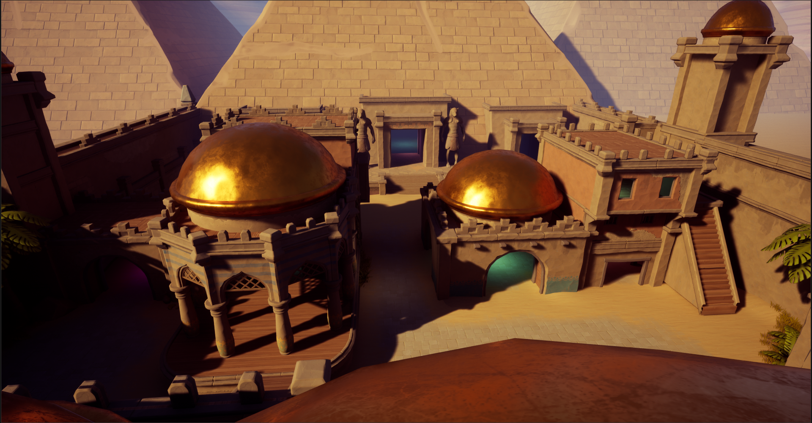

# StandOffChronoWarriors
 A multiplayer third person shooter in unreal engine. source and blueprints only

# Images

# Technologies Used in Game Development

This project leverages several powerful tools and technologies that are widely used in the game development industry to create high-performance, visually stunning games with realistic characters and environments.

## Languages and Tools

### 1. C++

**C++** is a low-level programming language that is commonly used in game development for its ability to access hardware directly, allowing developers to create high-performance games. It is used both for building game engines and game applications.

- **Key Benefits**: 
  - Direct access to system hardware
  - High performance for real-time game processing
  - Used for engine development and game mechanics
  
### 2. Unreal Engine

**Unreal Engine** is a powerful game engine developed by Epic Games. It provides a wide range of tools and features to support the creation of high-quality graphics, advanced physics simulations, and complex AI systems. Unreal Engine supports C++ programming as well as Blueprint, its visual scripting language.

- **Key Features**:
  - Advanced graphics rendering capabilities
  - Physics simulation and realistic environments
  - Supports complex AI behaviors and interactions
  - Large, active community of developers

### 3. Blender

**Blender** is a free and open-source 3D creation software widely used in game development for modeling, animation, rendering, and texturing. Its versatile toolset and user-friendly interface make it an excellent choice for creating game assets.

- **Key Features**:
  - 3D modeling, sculpting, and animation tools
  - Powerful rendering and texturing capabilities
  - Customizable interface and extensive community support
  - Free and open-source
  
### 4. Quixel Mixer

**Quixel Mixer** is a 3D texturing application that allows artists to create high-quality textures for game assets. It integrates seamlessly with the Quixel Megascans library, which offers a wide range of realistic surfaces and materials for game development.

- **Key Features**:
  - Extensive texture library via Quixel Megascans
  - Intuitive texturing tools for unique and realistic materials
  - Real-time feedback during texture creation
  
### 5. Character Creator 4

**Character Creator 4** is a software application used to create detailed and customizable 3D characters for games. It offers a wide range of templates, body types, clothing, and accessories, as well as real-time rendering and animation tools.

- **Key Features**:
  - Extensive customization options for characters
  - Real-time rendering for efficient workflows
  - Tools for facial expressions, body morphs, and animations
  
### 6. FABRIK IK

**FABRIK IK** is a plugin for Unreal Engine designed to help developers create realistic character movements through forward and backward reaching inverse kinematics (IK). It simplifies the process of generating dynamic and responsive animations.

- **Key Features**:
  - Realistic and dynamic character animations
  - Supports forward and backward inverse kinematics
  - Reduces complexity in animation creation

---

# Multiplayer Game Modules Overview

This project is a multiplayer game framework that integrates with Steam and features a modular approach to character, combat, game modes, and more. It follows an authoritative client-server model and uses Steamworks APIs for player identification, matchmaking, and networking.

## Modules

### 1. Multiplayer Sessions Module

The **Multiplayer Sessions** module creates a multiplayer environment where players can connect and play together.

- **Steam Integration**: Uses Steamworks APIs for player identification, authentication, matchmaking, and networking.
- **Authoritative Client-Server Model**: Server handles game simulation and logic; clients receive updates and send input.
- **Host Machine/Server**: Manages the game state and resolves conflicts.
- **Clients**: Handle rendering and user input, and communicate with the server.
- **Level Travel**: The server controls the progression through levels.
- **Steam Identity and Authentication**: Uses SteamID for secure player identification.
- **Networking and Communication**: Ensures real-time data synchronization between clients and the server.
- **Steam Friends and Invitations**: Players can invite friends to join multiplayer sessions.

### 2. Character Module

The **Character** module defines the attributes, behaviors, and interactions of playable characters.

- **Attributes**: Health, movement speed, and weapon inventory.
- **Hitboxes**: Define areas for damage detection.
- **Health and Damage**: Manages health levels, damage calculations, and related events.
- **Animation Triggers**: Handles the conditions for triggering character animations.
- **Equipping Weapons**: Manages the player's weapon inventory and usage.
- **Team and Game Mode Implementation**: Supports team-based logic and rules for specific game modes.
- **Movement and Aiming**: Handles player movement and aiming mechanics.
- **AnimInstance Class**: Manages animation states, blending, and transitions.
- **3D Model Creation and Rigging**: Involves character modeling, texturing, rigging, and animation.

### 3. Game Mode Module

The **Game Mode** module defines various game modes and their specific rules and logic.

- **Free for All**: Individual competition with scoring and respawn mechanics.
- **Capture the Flag**: Team-based mode where players capture the enemy flag to score points.
- **Teams**: Team-based mode that includes collaboration and team-specific mechanics.
- **Lobby Gamemode**: Manages player joining, team assignment, and preparation before the game starts.

### 4. Combat Module

The **Combat** module focuses on managing all combat-related functionalities.

- **Weapon Handling**: Equipping, firing, reloading, and throwing grenades.
- **Combat State and HUD**: Tracks the player's combat state and updates HUD elements.
- **Aim Handling and Field of View (FOV)**: Manages aiming mechanics and FOV adjustments.
- **Multiplayer Replication and Server Authority**: Handles the synchronization of combat actions between clients and the server.

### 5. HUD Module

The **HUD** (Heads-Up Display) module provides the player with important in-game information.

- **Health Bars**: Displays the player's current health.
- **Ammunition Displays**: Shows the player's current ammo count.
- **Buff Indicators**: Visual cues for active buffs.
- **Other Relevant Information**: Additional information related to the player's status and game state.

### 6. Pickup Module

The **Pickup** module manages in-game pickups like buffs and ammunition.

- **Pickup Types**: Defines different types of pickups and their effects.
- **Spawning and Placement**: Handles the distribution and placement of pickups in the game world.
- **Collision and Interaction**: Manages player interaction with pickups.
- **Buff Effects**: Applies enhancements to the player based on pickups.
- **Ammunition Refills**: Replenishes the player's ammunition.
- **Despawn and Respawn**: Controls the lifecycle of pickups, including respawn timers.
- **Visual and Audio Feedback**: Provides feedback when pickups are collected.
- **Networking and Replication**: Ensures pickups are synchronized in multiplayer environments.

### 7. Weapon Module

The **Weapon** module defines the characteristics and mechanics of various weapons.

- **Weapon Types**:
  - Pistol: Semi-automatic, moderate damage and accuracy.
  - Shotgun: Close-range, spread pattern.
  - Sniper Rifle: Long-range, high accuracy with zoom.
  - Grenade Launcher: Projectile-based, area-of-effect damage.
  - Rocket Launcher: Explosive, powerful with splash damage.
  - Assault Rifle: Fully automatic, continuous firing.
- **Weapon Pickup**: Manages weapon acquisition and state.
- **Weapon Animations**: Handles animations for equipping, firing, and reloading.
- **Damage Calculations**: Determines damage based on weapon type and hit location.

### 8. Lag Compensation Module

The **Lag Compensation** module addresses network latency issues in multiplayer environments.

- **Client-Side Prediction**: Simulates immediate actions on the client side.
- **Interpolation and Extrapolation**: Smooths movement and positioning of game objects.
- **Server-Side Validation**: Validates client actions to maintain fairness and integrity.
- **Latency Compensation**: Adjusts the timing of actions based on network latency.
- **Hit Detection and Resolution**: Ensures fair resolution of hits across clients.

---
